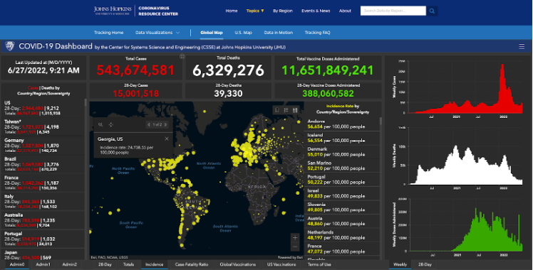
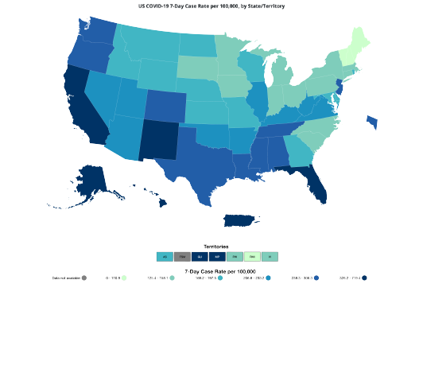
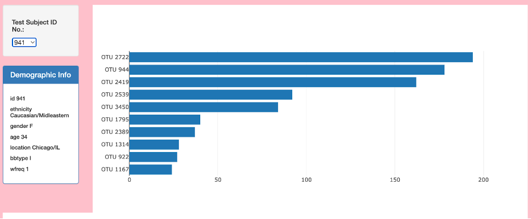
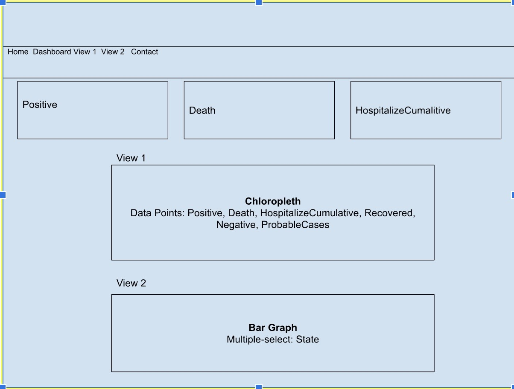

# US Covid Tracking: Visualization of Data

## Contributors 
- Sravitha Matlapudi
- Tanisha Cooper
- Hannah Allen
- Jeff Frazier

## Background
This generation has experienced an all-time historic event. The entire world has been greatly impacted, particularly the United States. As a result, many are probably wondering, when will the Covid-19 pandemic end already? There are also others with questions on status of the pandemic historic and/or current hospitalizations, total cases, deaths, and recovered cases. A dashboard quickly shows numbers for the latter, but the goal of this project was to explore these topics in depth including an interactive chloropleth covid map of the United States that help to answer total cases, cumulative tests, and hospitalizations. The rationale behind the selection of this topic/data is to provide information for those with an interest in the rise and decline of COVID cases by state. The latter would allow one to view trends and to anticipate precaution, supplies, and/or hospital influx.

## Configuration

As a team, we split out tasks to ensure that we complete the challenge within a timely manner. Below you can find the process/configuration. 

1. **[Project Proposal](https://docs.google.com/document/d/1EkK7s-hrbfpuLD8JQimp48hNTOVaU1L6Duz4obrLrRY/edit)**
    * **Topic/Rationale/Use Cases:** Determine what use cases and data we want to visualize. Use cases help determined how our data would help our audience. Review link above to identify a list use cases and the project proposal. 
    * [Data Set](./Data/covid_data.json): Selected the dataset for historical COVID-19 as data collection by state ended on March 07, 2021 per website. We selected the api and studied the json data to best know how to visualize it for our audience.
    * **Specifications:** Assisted in sketching our final design by pulling in pictures on how we want to display our data. Determined that we wanted a dashboard, chloropleth map, bar graph, and gauge to showcase our data. See images we gathered our inspiration. 

    
    
    
    
    * **Sketch Final Design:** From the inspirational maps and data, we sketched what we felt would be the final design of our data visualization. 
    

    * **Github Link:** [Project Repo](https://github.com/sravitham/US_Covid_Tracking.git)
    
2. Team Tasks & Processes
   > 1. ETL
   > 2. HTML/CSS Template
   > 3. JS
       > 1. Dashboard
       > 2. Chloropleth Map
       > 3. Bar Graph
       > 4. Solid Gauge

# Data Visualization

* Main Page

* View One

* View Two

* View Three

* Our Team

## Resources/Tools
* Plotly
* Pandas
* Numpy
* HTML/CSS
* JS/JS Libraries
    - jQuery
    - D3.js
    - Animated.js
    - Platform.js
    - holder.js
    - popper.min.js
    - bootstrap.min.js
* Bootstrap

